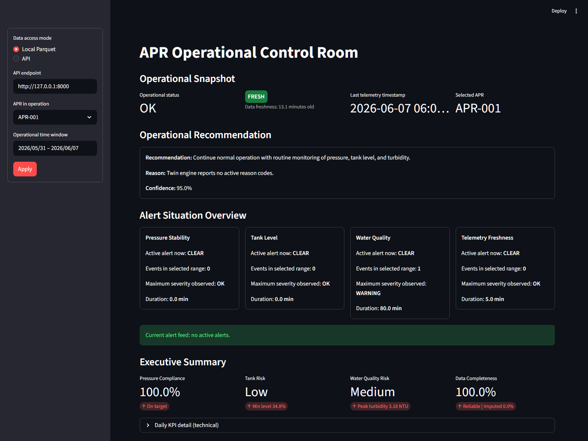
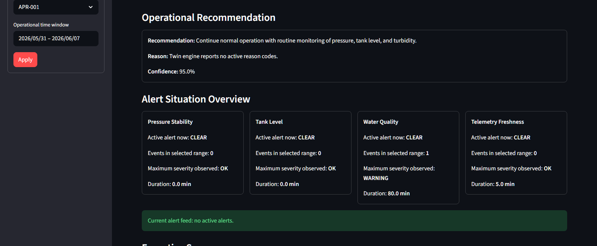

# APR Digital Twin MVP

## Overview

APR Digital Twin is a local-first MVP for demonstrating an explainable digital twin workflow for rural drinking water systems, known in Chile as APR systems. It addresses a practical operations problem: turning telemetry-like signals into a clearer view of pressure, tank level, water quality, data freshness, operational status, and recommended next actions.

The current MVP uses synthetic telemetry. It does not connect to field sensors or production infrastructure. The repository combines local data pipelines, an explainable twin engine, a FastAPI API, and a Streamlit dashboard so the full demo can run from one machine.

## Quick Start

Minimum Python version: Python 3.11 or newer.

Clone the repository:

```powershell
git clone https://github.com/sergiodelgado/apr-digital-twin.git
cd apr-digital-twin
```

Create and activate a virtual environment in Windows PowerShell:

```powershell
python -m venv .venv
.\.venv\Scripts\Activate.ps1
```

Linux or WSL alternative:

```bash
python -m venv .venv
source .venv/bin/activate
```

Install the project in editable mode:

```powershell
python -m pip install -e .
```

Prepare demo data:

```powershell
python scripts/demo_workflow.py prepare --scenario normal --apr-id APR-001 --days 7 --freq-minutes 5
```

Start the API in a second terminal:

```powershell
python scripts/demo_workflow.py api --port 8000
```

Start the dashboard in a third terminal:

```powershell
python scripts/demo_workflow.py dashboard --port 8501
```

Open:

- FastAPI: `http://127.0.0.1:8000`
- FastAPI interactive docs: `http://127.0.0.1:8000/docs`
- Streamlit dashboard: `http://localhost:8501`

In the dashboard, use:

- `Data access mode`: `API`
- `API endpoint`: `http://127.0.0.1:8000`
- `APR in operation`: `APR-001`

## Expected Result

After a successful local run:

- FastAPI is available at `http://127.0.0.1:8000`.
- The Streamlit dashboard is available at `http://localhost:8501`.
- Demo APR `APR-001` is available/selectable.
- The dashboard shows an operational status for the selected APR.
- KPI and telemetry views are populated from the local synthetic demo data.
- Twin outputs include supported explainability fields such as confidence, reason codes, possible root cause, active alerts, and operational recommendations.

### Dashboard Preview

The following screenshots were captured from the running local Streamlit dashboard using synthetic demo data for `APR-001`.





## Architecture

```text
Synthetic Telemetry -> Bronze -> Silver -> Gold -> Twin Engine -> API -> Dashboard
```

### Architecture Diagram



- Synthetic Telemetry: `src/apr_twin/synthetic/generator.py` creates local synthetic APR telemetry for demo and scenario runs.
- Bronze: raw synthetic telemetry is written as local Parquet files under `data/bronze/`.
- Silver: `src/apr_twin/pipelines/bronze_to_silver.py` validates, cleans, deduplicates, imputes limited gaps, and writes cleaned telemetry plus quality outputs.
- Gold: `src/apr_twin/pipelines/silver_to_gold.py` computes daily operational KPIs from Silver telemetry.
- Twin Engine: `src/apr_twin/twin/engine.py` evaluates current operational state, freshness, confidence, reason codes, hydraulic signals, and recommendations.
- API: `src/apr_twin/api/main.py` exposes health, APR availability, telemetry, KPI, and twin-state endpoints through FastAPI.
- Dashboard: `src/apr_twin/dashboard/app.py` visualizes the operational state and trends using local Parquet data or the API.

The MVP is local and file-based. It uses local Python processes and local Parquet storage, with `APR_DATA_DIR` available as an optional data directory override.

## Demo Scenarios

Prepare a scenario with:

```powershell
python scripts/demo_workflow.py prepare --scenario normal --apr-id APR-001
```

Scenarios currently documented and supported include:

- `normal`
- `stale_data`
- `low_pressure`
- `high_turbidity`
- `projected_low_tank_level`
- `pump_on_no_recovery`
- `abnormal_tank_drop`
- `low_pressure_with_normal_storage`
- `demand_spike_with_storage_depletion`
- `noisy_or_erratic_tank_sensor`

See the scenario playbook for expected storylines and reason-code behavior.

## Repository Structure

```text
.agents/
  automations/
  skills/
data/
  bronze/
  silver/
  gold/
docs/
  architecture/
  demos/
  operations/
  reports/
  roadmap/
scripts/
  demo_workflow.py
  run_mvp.py
src/
  apr_twin/
    api/
    dashboard/
    pipelines/
    storage/
    synthetic/
    twin/
    utils/
tests/
CHANGELOG.md
README.md
pyproject.toml
```

## Technical Documentation

- [Documentation index](docs/README.md)
- [MVP architecture](docs/architecture/mvp-architecture.md)
- [Data flow](docs/architecture/data-flow.md)
- [Demo workflow](docs/demos/demo-workflow.md)
- [Scenario playbook](docs/demos/scenario-playbook.md)
- [Operations runbook](docs/operations/runbook.md)
- [Troubleshooting](docs/operations/troubleshooting.md)
- [Roadmap](docs/roadmap/roadmap.md)
- [Current technical state report](docs/reports/estado-tecnico-actual.md)
- [Changelog](CHANGELOG.md)

## Operations Commands

Run the end-to-end local batch flow:

```powershell
python scripts/run_mvp.py --days 7 --freq-minutes 5 --apr-id APR-001
```

Run the manual pipeline steps:

```powershell
python -m apr_twin.synthetic.generator --days 7 --freq-minutes 5 --apr-id APR-001
python -m apr_twin.pipelines.bronze_to_silver
python -m apr_twin.pipelines.silver_to_gold
```

Start API and dashboard through the demo helper:

```powershell
python scripts/demo_workflow.py api --port 8000
python scripts/demo_workflow.py dashboard --port 8501
```

Equivalent direct commands:

```powershell
uvicorn apr_twin.api.main:app --reload --port 8000
python -m streamlit run src/apr_twin/dashboard/app.py
```

API health checks:

```powershell
Invoke-RestMethod http://127.0.0.1:8000/health
Invoke-RestMethod "http://127.0.0.1:8000/twin/state?apr_id=APR-001"
```

Optional data directory override:

```powershell
$env:APR_DATA_DIR = "C:\temp\apr-data"
```

## Tests

Run the automated test suite:

```powershell
python -m pytest -q
```

The tests cover pipeline behavior, API endpoints, and scenario-specific twin logic.

## Current Maturity / Limitations

Implemented capabilities:

- Local synthetic telemetry generation.
- Bronze, Silver, and Gold Parquet-based processing.
- Silver quality outputs including rejected records and a quality report.
- Daily KPI generation.
- Explainable twin state with status, freshness, confidence, reason codes, hydraulic signals, possible root cause, active alerts, and recommendations.
- FastAPI endpoints for health, available APRs, recent telemetry, daily KPIs, and twin state.
- Streamlit dashboard with local Parquet mode and API mode.
- Demo scenarios for normal operation, stale data, pressure, turbidity, projected low tank level, and hydraulic behavior.

Current limitations:

- Telemetry is synthetic in the current MVP.
- No implemented integration with real field sensors.
- No cloud storage, managed streaming, message queues, or event-driven infrastructure.
- No authentication, authorization, or multi-tenant access model.
- No formal benchmark suite for runtime, latency, scale, or data volume.
- Dashboard is intended for local demo and technical validation, not as a production control room.

Not production-ready assumptions:

- Operational rules and thresholds require calibration with real APR field data before operational use.
- Local Parquet storage is suitable for MVP reproducibility, not production multi-user operations.
- Automated recommendations should be treated as explainable demo outputs, not authoritative operational decisions.
- Production deployment, observability, security controls, data governance, and real sensor ingestion are outside the implemented MVP.

## Roadmap / Next Steps

The current roadmap keeps the local MVP architecture intact. Near-term work documented in the repository includes stronger data quality metrics, expanded scenario coverage, additional edge-case tests, and dashboard presentation polish. Mid-term items include API contract examples, runtime and data-volume benchmarks, and standardized demo-day runbooks.

See [docs/roadmap/roadmap.md](docs/roadmap/roadmap.md) for the current roadmap.
